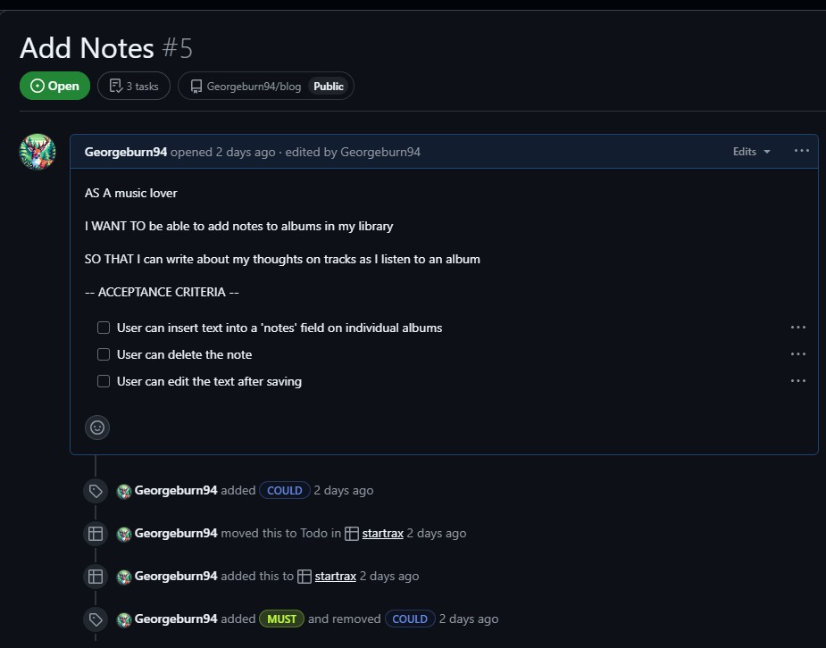
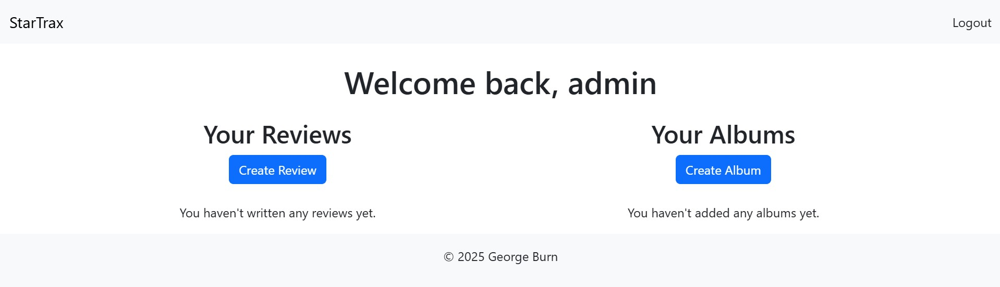

# StarTrax Django Project

## Introduction

## Agile Development
To manage this project efficiently, I utilized GitHub's Project Board to implement agile development practices, allowing me to organize user stories into acceptence criteria and track progress.

### Must Haves
My must have criteria are outlined below. A user must be able to login, register and logout. They must be able to create, update, delete and read the reviews on their account. They must also be able to add and delete the albums that the reviews are associated with.

#### Star Rating

#### Add Notes

#### User Account

#### Add Library

### Should Haves

#### Album Covers
AS A music collector

I WANT to be able to see the album artwork of my library

SO THAT I can have a sense of a music library

-- ACCEPTANCE CRITERIA --

User can upload album artwork and tie it to albums

User can see album artwork in libraray

#### Clean Design
AS A Music Enthusiast

I WANT the website design to be calming and minimal

SO THAT it creates a calming atmosphere and I can thoughtfully enter my notes and ratings

-- ACCEPTENCE CRITERIA --

Calming choice of fonts

Elements on page kept to minimum

Modal to create album reviews is minimally styled (like calmly writer)

#### Add Album Review
AS A music lover

I WANT a space to insert a written comment on an album

SO THAT I can record my thoughts on an album

-- ACCEPTENCE CRITERIA --

User can create written comments for albums in their library

User can delete existing comments

User can edit existing comments

### Could Haves

#### See Friends Reviews
AS A Music Lover

I WANT TO be able to see my friend's ratings

SO THAT I can compare my thoughts with theirs

-- ACCEPTENCE CRITERIA --

Ability to see ratings of friends on Spotify

#### Connect to Spotify
AS A Spotify User

I WANT TO be able to connect my Spotify account

SO THAT I can add ratings and reviews to my existing music library

-- ACCEPTENCE CRITERIA --

Connect to Spotify API

Import user library

Add data to user library from Spotify user library

## Wireframes

### Homepage

### Create an account

### New Album Input

### New Review Input

## Entity Relationship Diagram
See below for ERD. Albums are tied to reviews, which are tied to users. I chose to use Django's inbuilt user system for this project

## Testing
Using GitHub Copilot I generate automated tests for the website's main features. These tests were implemented using the pytest framework.

The tests were as follows:
- a user can create a review
- a review can be updated
- a review can be deleted
- an album can be created
- an album can be deleted
- homepage welcomes client
- navigation links work correctly

## Deployment
Using manual deployment from a GitHub branch, I deployed using Heroku.

See deployed URL below;
https://startrax-draft-5e0a1c66b441.herokuapp.com/

## Deployment

This project is deployed on Heroku, with the database hosted on Neon Tech PostgreSQL. Below are detailed instructions for both setting up the project locally and deploying it to Heroku.

### Local Deployment

#### Prerequisites
- Python 3.8+
- pip (Python package installer)
- Git

#### Steps to Clone and Run Locally

1. **Clone the repository**
Use the below commands:

git clone https://github.com/georgeburn94/startrax.git

cd startrax
2. **Create a virtual environment**
python -m venv venv

3. **Activate the virtual environment**
- Windows: `venv\Scripts\activate`
- Mac/Linux: `source venv/bin/activate`

4. **Install required packages**
pip install -r requirements.txt

5. **Create an env.py file**
Create a file named `env.py` in the root directory with the following content:

import os

os.environ.setdefault('SECRET_KEY', 'your-secret-key') 
os.environ.setdefault('DATABASE_URL', 'your-database-url')
os.environ.setdefault('DEBUG', 'True')  # Set to 'False' in production

6. **Create an env.py file**
python manage.py migrate

7. **Create a superuser**
python manage.py createsuperuser

8. **Run the development server**
python manage.py runserver

9. **Access the site** 
Open your browser and go to http://127.0.0.1:8000/

#### Steps for Heroku Deployment
Create a new Heroku application

##### Logging into Heroku
Log in to Heroku Dashboard
Click "New" > "Create new app"
Enter a unique app name and select your region
Click "Create app"
Set up database

##### Creating a database
Create a PostgreSQL database on Neon Tech or similar service
Note the connection URL for the next steps
Configure environment variables

##### Setting config Vars
In your Heroku app dashboard, go to "Settings" tab
Click "Reveal Config Vars"
Add the following variables:
SECRET_KEY: Your Django secret key
DATABASE_URL: Your PostgreSQL connection URL
DEBUG: False
ALLOWED_HOSTS: your-app-name.herokuapp.com
Prepare your application

##### Required files
Ensure your project has these files in the root directory:
requirements.txt: Lists all dependencies
Procfile: Contains web: gunicorn config.wsgi:application
runtime.txt: Specifies Python version (e.g., python-3.8.15)
Deploy your application

##### Deploying in Heroku from Github
In your Heroku dashboard, go to the "Deploy" tab
Under "Deployment method", select "GitHub"
Connect your GitHub account if not already connected
Search for your repository and click "Connect"
Scroll down to "Manual deploy" section
Select the branch to deploy (usually main)
Click "Deploy Branch"
Wait for the build process to complete
Run migrations on Heroku

##### Creating a superuser
In the Heroku dashboard, click on "More" > "Run console"
Run python manage.py migrate
Create a superuser

In the Heroku console, run python manage.py createsuperuser
Follow the prompts to create an admin user
View your application

##### Viewing deployed site
Click on "Open app" button in the top right of the Heroku dashboard
Your app should now be live at https://<your chosen name>.herokuapp.com
Important Files
Procfile: Tells Heroku how to run the application
requirements.txt: Lists all Python dependencies
runtime.txt: Specifies the Python version for Heroku
env.py: Contains environment variables (local development only, not committed to version control)
Database Management
The project uses PostgreSQL for the database:

For local development, you can use SQLite or a local PostgreSQL instance
For production, StarTrax uses Neon Tech PostgreSQL
Environment Variables Security
For security, ensure that:

env.py is listed in your .gitignore file to prevent sensitive information from being committed
All sensitive credentials are stored in Heroku Config Vars for the deployed version

# Role Based Login
I created role based login for authorised and unauthorised users. Users are not permitted to create/delete albums or reviews, whereas Admin users are.

Roles are assigned using custom python code. assign_roles.py and create_roles.py contain these commands.

See below for screenshots
## Authorised User

Admins have the option to create albums or reviews

## Unauthorised User

Unauthorised users cannot create albums or reviews

# Reflection on use of AI in the project
Throughout the development of this project, AI played a crucial role in debugging and adding new features, especially in areas where I was unfamiliar with the necessary code. The AI significantly reduced the time I spent debugging by providing immediate solutions, which allowed me to focus more on the overall development process.

## Where the AI was useful
The AI was most useful in the debugging part of development. Django offered detailed traceback solutions - and copy and pasting them into Copilot was able to resolve these issues quickly and painlessly. 

It was also useful when dealing with features I hadn't encountered before in the LMS. For example the notification that comes with changes to data. I did not know how to implement messages this, but by using a multi-step reverse prompt I was able to specificy my requirements and the feature worked in the first instance. Being able to include these messages improved the User Experience.

## AI in testing
This was an example of where AI helped me to implement something I would not have otherwise been able to accomplish. Using a multi-step prompt, I asked Copilot to create me automated tests for all of the features existing in my project. The tests ran without issue. To learn, implement and debug the testing process myself would have taken days, but with Copilot assistance it was completed in about 25 minutes.

## Issues
While the AI's code suggestions were often helpful, there were instances where its solutions were overly complex. This highlighted the importance of understanding the code myself. Not blindly following code I didn't understand and then being stuck when it breaks.

One example of this was when I was creating the User Accounts section. Initially, the AI suggested using a 3rd party dependency, which I didn't fully understand. I was then able to specify that Django's built in account system to be used, creating a much simpler solution.

I saw the AI as a co-developer, contributing valuable insights and code snippets, but I maintained control over the decision-making process. Overall, the collaboration with AI resulted in a much faster development cycle, helping me achieve milestones more efficiently.

