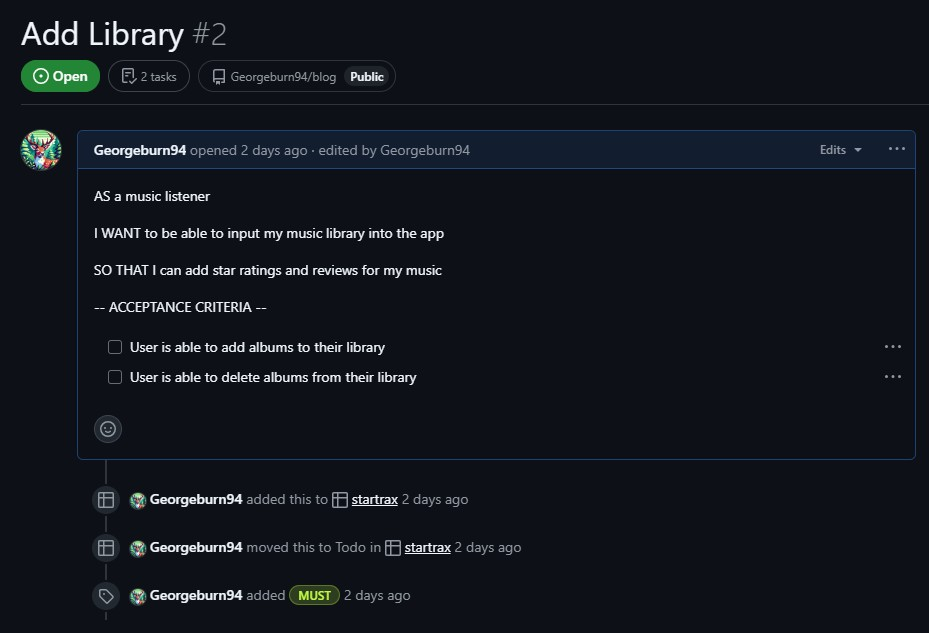
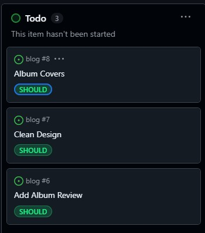

# StarTrax Django Project

## Introduction

## Agile Development
To manage this project efficiently, I utilized GitHub's Project Board to implement agile development practices, allowing me to organize user stories into acceptence criteria and track progress.

### Must Haves
My must have criteria are outlined below. A user must be able to login, register and logout. They must be able to create, update, delete and read the reviews on their account. They must also be able to add and delete the albums that the reviews are associated with.

#### Star Rating

#### Add Notes

#### User Account

#### Add Library

### Should Haves

#### Album Covers
AS A music collector

I WANT to be able to see the album artwork of my library

SO THAT I can have a sense of a music library

-- ACCEPTANCE CRITERIA --

User can upload album artwork and tie it to albums

User can see album artwork in libraray

#### Clean Design
AS A Music Enthusiast

I WANT the website design to be calming and minimal

SO THAT it creates a calming atmosphere and I can thoughtfully enter my notes and ratings

-- ACCEPTENCE CRITERIA --

Calming choice of fonts

Elements on page kept to minimum

Modal to create album reviews is minimally styled (like calmly writer)

#### Add Album Review
AS A music lover

I WANT a space to insert a written comment on an album

SO THAT I can record my thoughts on an album

-- ACCEPTENCE CRITERIA --

User can create written comments for albums in their library

User can delete existing comments

User can edit existing comments

### Could Haves

#### See Friends Reviews
AS A Music Lover

I WANT TO be able to see my friend's ratings

SO THAT I can compare my thoughts with theirs

-- ACCEPTENCE CRITERIA --

Ability to see ratings of friends on Spotify

#### Connect to Spotify
AS A Spotify User

I WANT TO be able to connect my Spotify account

SO THAT I can add ratings and reviews to my existing music library

-- ACCEPTENCE CRITERIA --

Connect to Spotify API

Import user library

Add data to user library from Spotify user library

## Wireframes

### Homepage

### Create an account

### New Album Input

### New Review Input

## Entity Relationship Diagram
See below for ERD. Albums are tied to reviews, which are tied to users. I chose to use Django's inbuilt user system for this project
